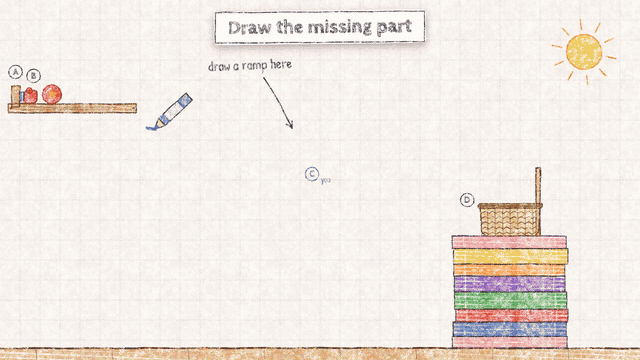
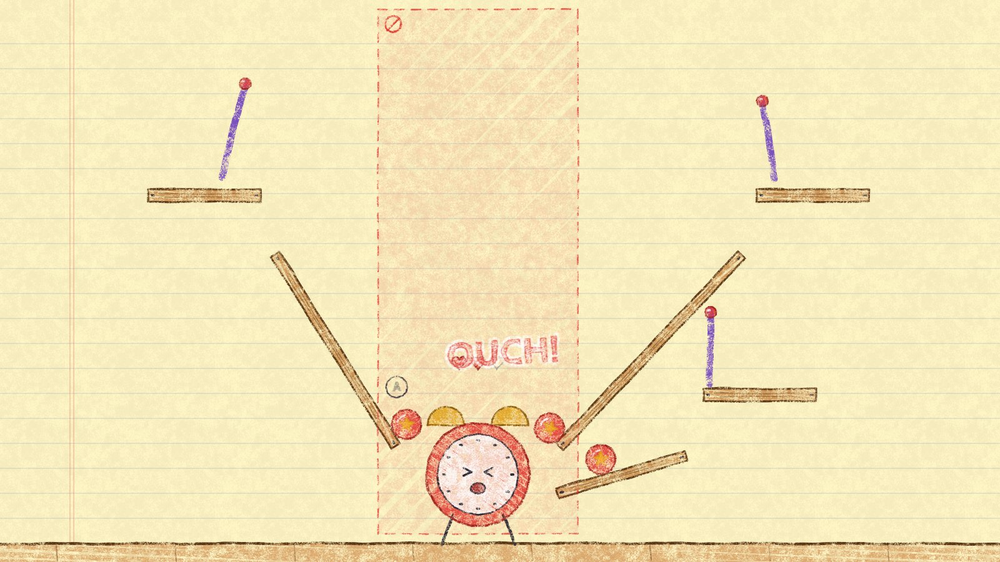
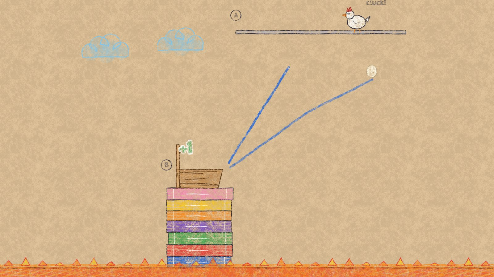
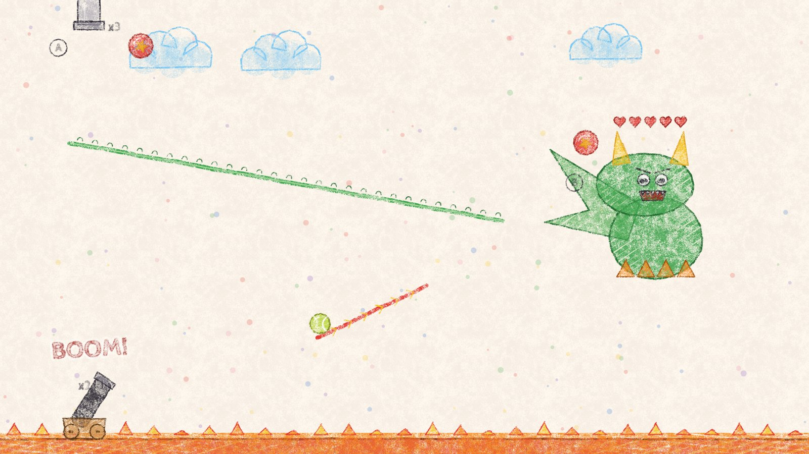
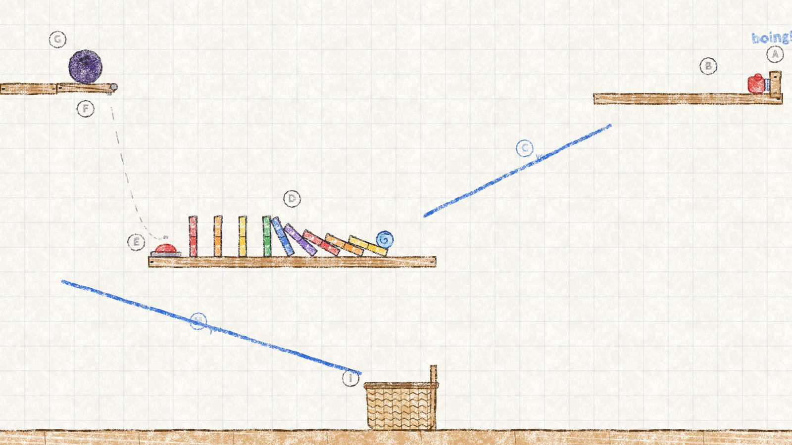

<h1 align="center">Crayon Contraptions</h1>

<p align="center"><em>Draw the missing part. Press GO. Watch every piece set off the next.</em></p>

<p align="center">
  <a href="https://winchxyz.github.io/crayon-contraptions/"></a>
  <a href="https://github.com/winchxyz/crayon-contraptions/releases/latest"></a>
</p>

<p align="center">
  
  
  
  
  
  
  <a href="LICENSE"></a>
</p>

<p align="center">
  
</p>

A Rube Goldberg machine puzzle drawn in crayon: 100 levels in ten worlds,
seven crayons with their own physics, live levels you draw while they run,
and a boss monster at the end of every world. The full 59-second demo video is
attached to the [latest release](https://github.com/winchxyz/crayon-contraptions/releases/latest).

| | |
| --- | --- |
|  |  |
|  |  |

| Crayon | Physics |
| --- | --- |
| Blue | stays put: ramps, bridges, catchers |
| Orange | heavy; hangs still while you draw, falls at GO |
| Green | bouncy (restitution 1) |
| Yellow | floats up (negative gravity) and slides along anything above it |
| Purple | pinned where you start the line; swings like a pendulum |
| Red | boosts anything touching it along the direction you drew; cars go turbo |
| Black | magnet: pulls steel balls from up to 3.2 m away |

The eraser rubs out only what is under it and splits lines around the gap.
Live levels (Quick Draw, Chaos Factory and three bosses) start on their own
after a countdown: the floor is lava, lines fade after a few seconds, and the
crayon meter refills over time.

Captions follow Rube Goldberg's own cartoons: each part carries a letter, the
story reads the chain in order, and a dashed blue letter marks what you draw.

## Run it

```
node dev-server.js 8850      # http://localhost:8850
node tools/gen.js            # (re)generate js/levels.js from the plan
node test/verify.js          # prove all 100 levels from js/levels.js
node build.js                # docs/index.html (GitHub Pages) + dist/ (single-file artifact)
```

GitHub Pages serves `docs/` from the `main` branch; run `node build.js` and
commit `docs/` to update the live site.

The demo video is recorded by the game itself: load `dev/demo.js` on the dev
server page and call `DEMO.run()`. It freezes the game loop and drives it on a
virtual 30 fps clock, so every frame is exact however slowly the browser
renders. `node tools/make-demo.js` then encodes `media/demo.mp4` and
`media/demo.gif` with ffmpeg.

## How the 100 levels are made

`tools/plan.js` lists every level: a handmade level from `tools/hand.js` or a
recipe from `tools/archetypes.js` with a difficulty. A recipe lays out a
machine with seeded variation and proposes drawings; `tools/genlib.js`
searches them in headless physics and keeps a layout only when

- a drawing wins,
- an empty sheet does not,
- and nudged copies of the winning drawing (shifted, tilted, drawn a little
  early or late) mostly still win.

Live levels and bosses are searched in stages (one drawing per ball or per
hit). The winning drawing ships as the level's hint and sets its crayon
budget and star thresholds. `tools/gen.js` runs this on worker threads and
caches each level in `tools/cache/` until its recipe or the physics changes.
`node tools/try.js <recipe> <difficulty> <n> '{"crayons":["solid"]}'` builds
one recipe on its own.

## Layout

| File | What it holds |
| --- | --- |
| `js/sim.js` | Physics world, crayons, parts, win/lose rules (no DOM, runs in Node) |
| `js/levels.js` | Generated: 10 worlds, 100 levels, each with a proven answer |
| `js/crayon.js` | Wax-on-paper rendering: grain textures, wobbly lines, scribble fills, cached text |
| `js/draw.js` | How each part, crayon, paper and boss looks |
| `js/audio.js` | Synthesized sound (WebAudio, no files) |
| `js/app.js` | Input, live mode, the loop, screens, saved progress |

World units are metres on a 16 x 9 sheet with y pointing down and the floor
top at y = 8.7. The sheet renders at 100 px per metre. Physics is
[planck.js](https://github.com/piqnt/planck.js) 1.4.2 from jsdelivr; a copy in
`vendor/` feeds the Node tools.

Fonts are Cabin Sketch and Patrick Hand from Google Fonts. Code is MIT
licensed (see `LICENSE`); planck.js is MIT licensed by its authors.

`window.CCDBG` in the browser exposes `loadLevel(i)`, `solve()`, `playLive()`,
`advance(seconds)`, `eraseAt([x, y])`, `bench(frames)` and `shot(name)` (saves
a JPEG to `shots/` through the dev server).
